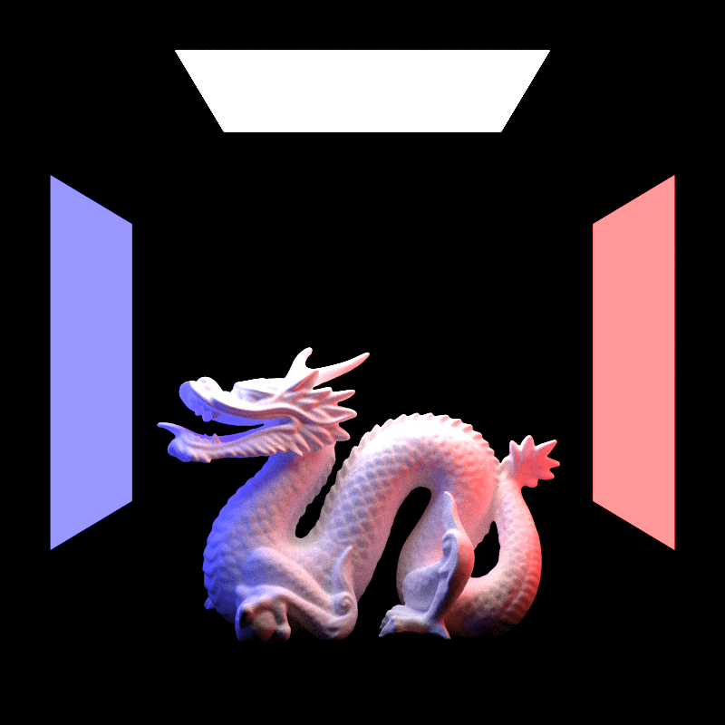

<div align="center">
  <a href="https://github.com/keenemeck/raytracing">
    
  </a>

<h3 align="center">Ray Tracing</h3>

  <p align="center">
    Ray tracer written in C++.
  </p>
</div>

### Installation

1. Clone the repo
   ```sh
   git clone https://github.com/keenemeck/raytracing.git
   ```
2. Build the project
   ```sh
   make
   ```
3. Run the program
   ```js
   ./main > images/image.ppm
   ```
   You can also redirect the image output elsewhere


## Usage

Modifying the scene is done by either adding primitives in the main.cpp, or by loading .objs.

By default, a cornell box with a bunny will be rendered, but any obj file may replace it. Note that scaling and offsetting may be required to make the model fit the scene. Running the output once will suggest outputs that should center the obj in the box.

A primitive's color or material properties (reflectivity, or emissivity) can be modified in the primitive's .mat member variable.

For higher fidelity renders, try raising the camera's image dimensions, or increasing the sample count per pixel. Both examples can be found in main.cpp.
